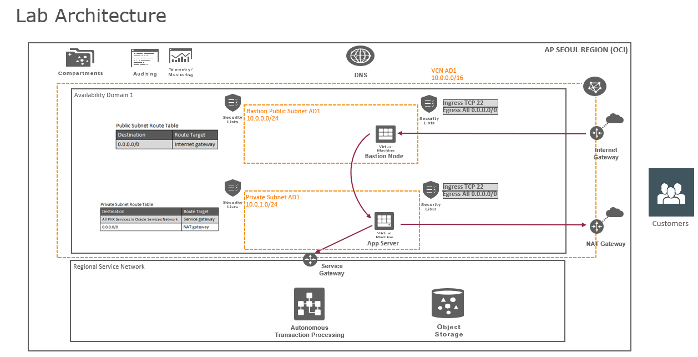
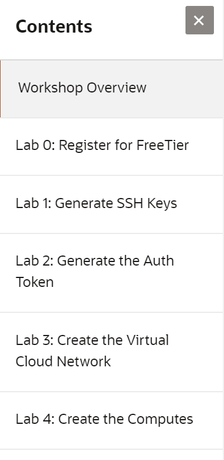

# Move and Improve Applications to OCI and ATP #

## Workshop Overview ##

In this workshop you will create a Virtual Cloud Network (VCN) and related network resources. A VCN is similar to your own on premise enterprise network.  In the Oracle Cloud, the network is software defined and virtual. This makes for very fast creation, but still providing high performance, and complete security. The architecture of your lab design follows.

## Workshop Requirements

- Account access to Oracle Cloud Infrastructure
  - You will need your own account.  An account is provided if this is an instructor-led workshop.
  - You will need an account that allows you to create a VCN, up to two cores of compute, and up to three cores of Autonomous Database.
  
- Knowledge of network concepts
- Knowledge of database concepts

## Agenda

- **Lab 0 :** Login to Oracle Cloud

This lab introduces the student lab environment and contains the steps to connect to the Oracle Cloud.

- **Lab 1** : Generate SSH Keys

Create the SSH public and private keys for secure access to your cloud compute environment

- **Lab 2** : Generate the Auth Token

Create the Auth Token password to access your cloud object store.

- **Lab 3 :** Create the Virtual Cloud Network

This section describes creating the virtual cloud network or VCN using the quick start wizard.

- **Lab 4 :** Create the Computes

This section describes creating two computes for your lab environment.  One compute will be used as a bastion node.  The second compute will be used as your application server.

- **Lab 5 :** Create Autonomous Database

This section describes creating the Oracle Autonomous Database.  We will provision the Autonomous Transaction Processing or ATP.

- **Lab 6 :** Copy SSH Key and Wallet

This section describes copying the ssh key and wallet for secure access to the private subnet and to ATP.

- **Lab 7 :** Install the Application and Migrate the Database

This section describes installing the Oracle client software and the application to your compute.  You will also migrate the database using Data Pump.

- **Lab 8 :** Run the Application Workload

This section describes running the application workload and scaling the ATP for higher performance using manual scaling and then auto scaling.

## Access the labs ##

- Use **Lab Contents** menu on your right to access the labs.
    - If the menu is not displayed, click the menu button  on the top right  make it visible.

- From the menu, click on the lab that you like to proceed with. For example, if you like to proceed to **Lab 0**, click **Lab 0: Login to the Oracle Cloud**.

- You may close the menu by clicking 

