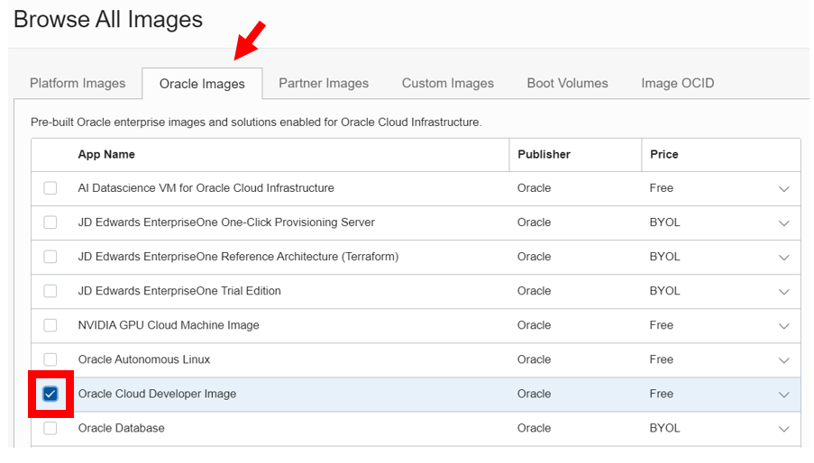
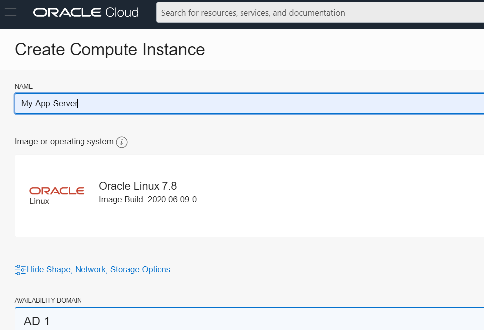
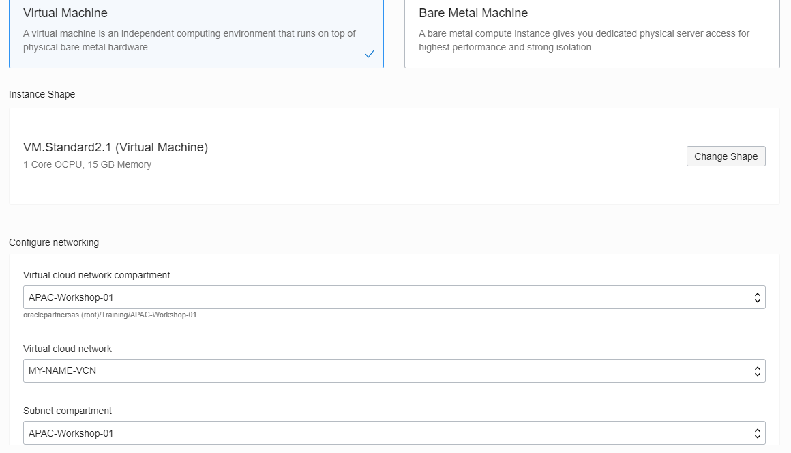
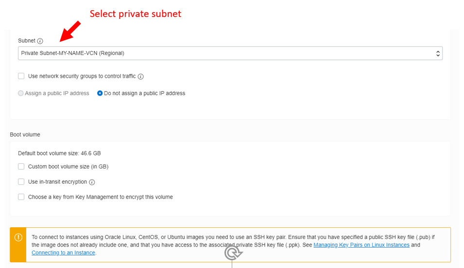
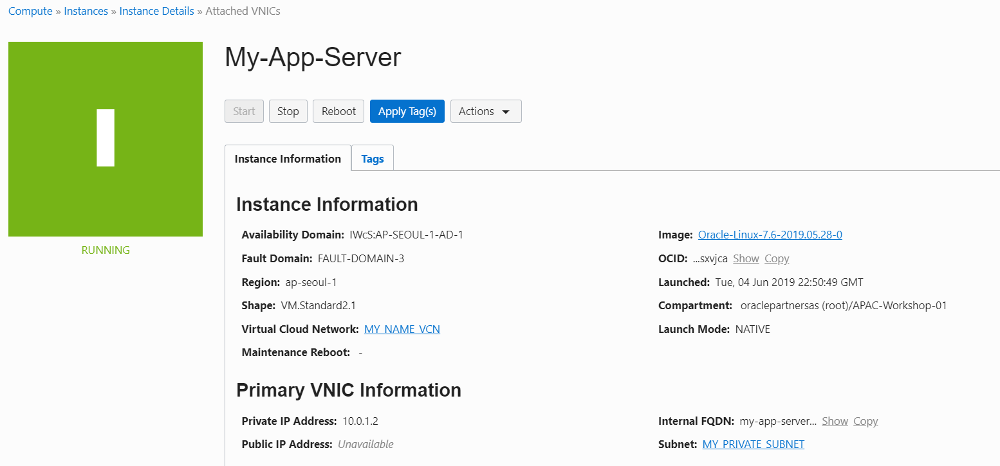
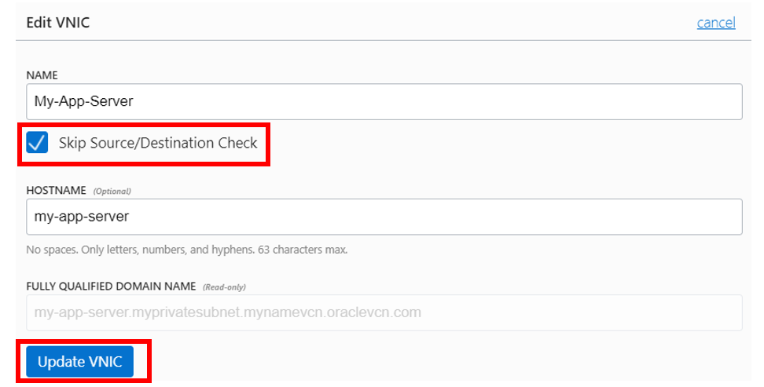
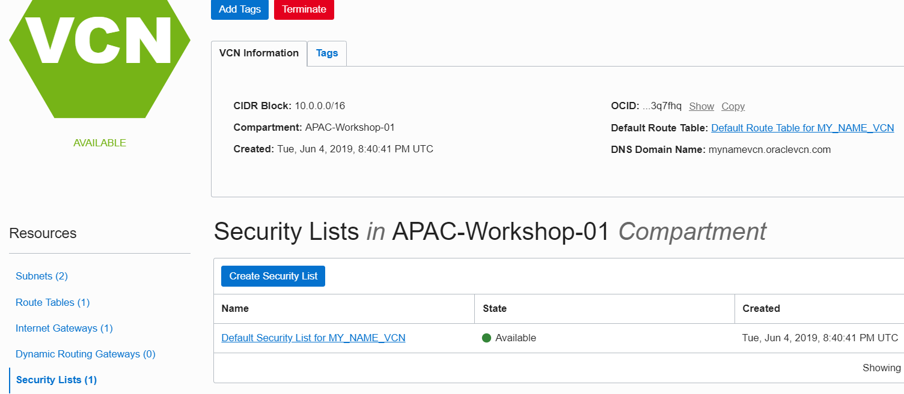
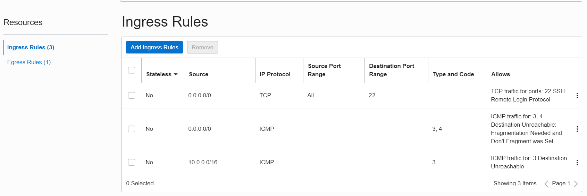
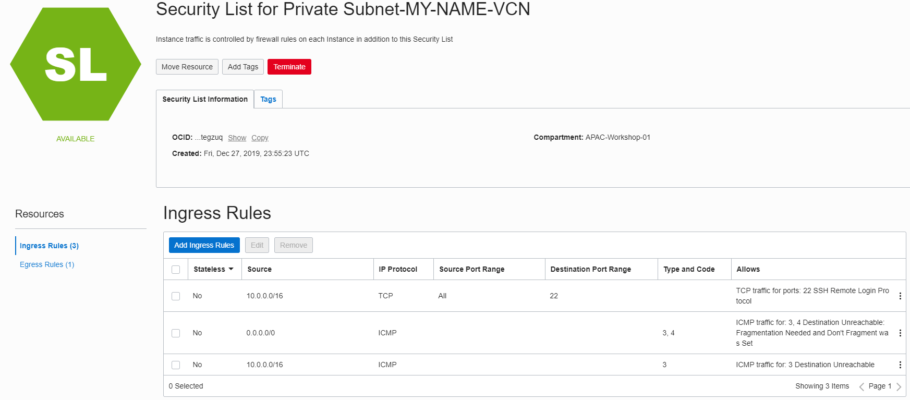
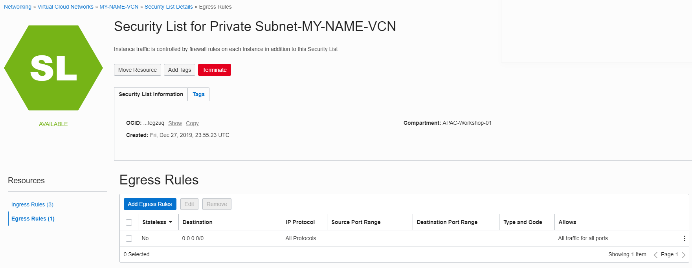

# Create the Computes #

Oracle Cloud computes come in many shapes.  They can be virtual machines or bare metal hardware.  In this lab we will create two virtual machines.  One will be a bastion server, sometimes called a "jump server", and it will be created in your public subnet, and the second will be the application server and it will created in your private subnet.

## Disclaimer ##
The following is intended to outline our general product direction. It is intended for information purposes only, and may not be incorporated into any contract. It is not a commitment to deliver any material, code, or functionality, and should not be relied upon in making purchasing decisions. The development, release, and timing of any features or functionality described for Oracle’s products remains at the sole discretion of Oracle.

## Requirements ##

- Web browser
- SSH public and private keys
  - For instructor-led class, your instructor may provide you with the SSH keys
  - You may also create your own SSH keys with PuTTyGen or equivalent
- WinSCP or equivalent
- PuTTY or equivalent

## Step 1: Create the Bastion Compute ##

We will create our first compute as a Bastion host on the public subnet. A Bastion is a “jump” host that will allow us to jump to the private compute. Private computes on private subnets can not be accessed from the internet directly.

​	1. Log in to Oracle Cloud

​	2. Click on the navigation menu on the top left, select Compute Instances.  Make sure you are in your region and compartment.

​	3. Click Create Instance

​	4. Give your instance a unique name

​	5. Click Change Image and select **Oracle Cloud Developer Image** from Oracle Images 

The Oracle Cloud Developer image has the Linux OS along with software client tools we will use. 

 6. After selecting the image, you must scroll down the screen and accept the terms and click Select Image

    

    

    

​	7. Select Availability Domain 1 (AD1)

	8. Select Virtual Machine VM.Standard2.1
 	9. Instance Shape should be 1 Core OCPU, 15 GB Memory. You can keep this default.

10. Select your VCN Compartment and VCN you created

11. Select your subnet Compartment.  It will be the same as your VCN Compartment in this lab. In some cases you can create subnet in other compartments. 

​	12. Select the **Public** subnet to create your compute on

​	13. Then select **Assign public IP address**

​	14. Keep the Boot Volume settings as is, with boxes unchecked

​	15. Add the SSH **public** key provided by the instructor or use your own 

​	16. Create your Instance

Once you click Create Instance, your instance will be in provisioning state. This will take a couple of minutes to create.

You can see the more status by clicking on Work Request.

Your running compute instance will have both the Public and Private IP address created. Resources inside the VCN can access Private IP addresses.

## Step 2: Connect to your Bastion Compute ##

Use PuTTy or SSH to connect to your bastion compute. Connect with the compute public IP address and your client side SSH private key provided by the instructor or use your own SSH key. You can use PuTTyGen or equivalent to create your own SSH public and private keys.  opc is the default admin user for the compute

For Linux SSH:

`ssh –i ~/../privatekey opc@<your compute public IP address>`

For PuTTY:

​	1. Enter the public IP address of the compute

​	2. Browse for your SSH private key

​	3. Save your settings and click Open

​	4. Click Yes when prompted

Oracle computes are provisioned with the default **opc** user with sudo privileges.

​	5. Login as **opc**

## Step 3: Create your Application Server

1. On the Private subnet create a compute for your application server
2. Name your instance as your app server
4. Use the latest default Oracle Linux image
4. If you have more than one availability domain, you can just select AD1

               

​	5. Please use the standard virtual machine with 1 core as pictured

​	6. Ensure you select your compartment and VCN. Your subnet compartment can actually be configured on another compartment from your VCN. But in this case it will be the same as your VCN.

	7. Select the Private subnet where the App Server will be installed.  Do not assign public IP address should be marked
 	8. Keep the Boot Volume defaults

​	9. Use the same SSH key as your bastion compute.  However the best practice is to use a different key

​	10. Click Create

You can see the work request and status of the compute being provisioned in the compute details and Work Requests page.

Once your compute App Server instance is running, view other details. Note the compute is provisioned on the private subnet, you only get a private IP address.  There is no public IP address.  From the private subnet we have a secure App Server that will connect to ATP.

Now we need to turn off VNIC source/destination check to allow packets to be forwarded.  Otherwise if the packet is not for the VNIC it will be dropped.

## Step 4: Turn off VNIC source/destination check

​	1. View the compute App Server instance details

​	2. Select Attached VNICs

​	3. Click on the 3 dots on the right of the VNIC

​	4. Select Edit VNIC

​	5. Check the box **Skip Source/Destination Check**

​	6. Click Save Changes or Update the VNIC on earlier UIs.

## Step 5: Check Security List for Each Subnet

Let's see how your security list are set up to ensure they allow the right traffic.

​	1. Navigate to your VCN details

​	2. Select Security Lists from your Resources

​	3. Check default security list used by the public subnet

		- Allow TCP ingress on port 22. (port 22 is for SSH)
		- Allow all egress to all destinations, ie: 0.0.0.0/0

​	ICMP is defaulted and is TCP/IP layer protocol for control and error messages.

​	

1. Check security list for private subnet. 

		- Ie: Ingress allows SSH from the VCN (this will also allow ingress for SCP copy of the ATP Wallet we will do shortly). 
		- Ie: Egress allows all protocol traffic to all destination.

## Acknowledgements ##

- **Author** - Milton Wan, Database Product Management, April 2020

