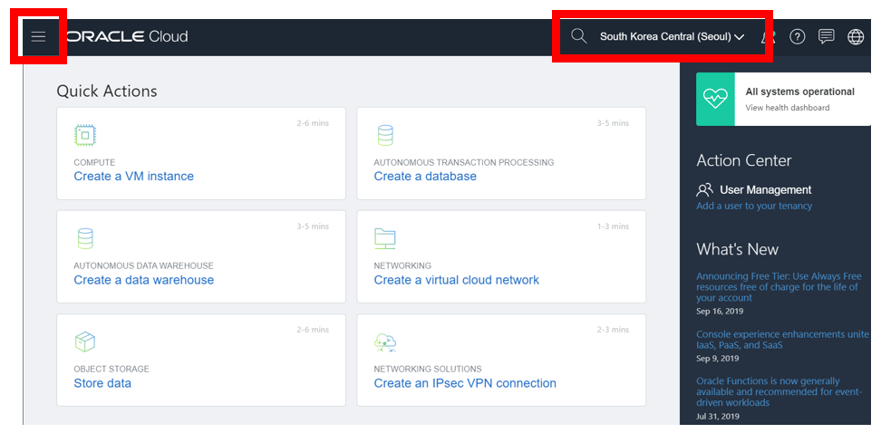
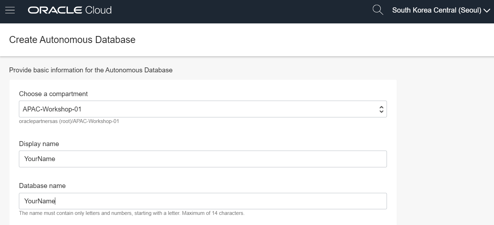
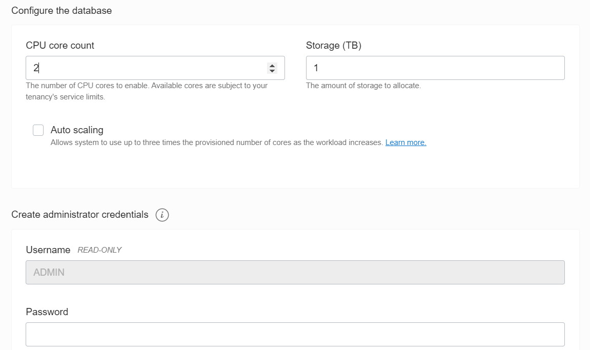
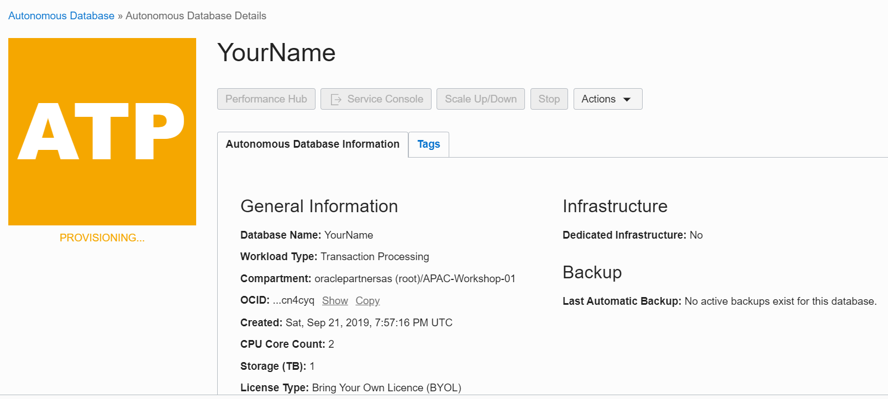
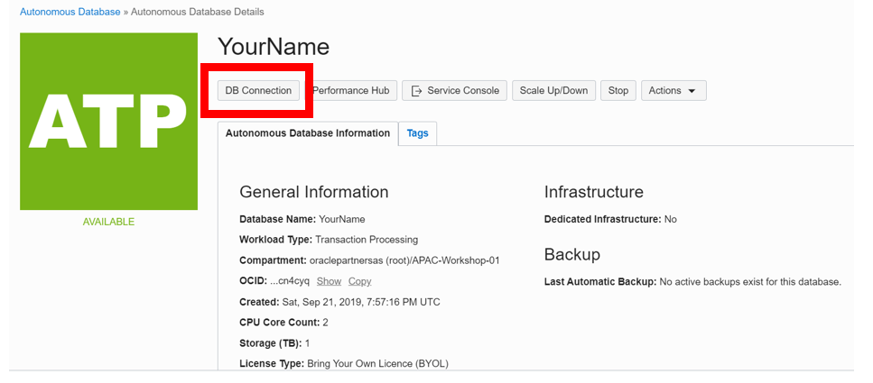
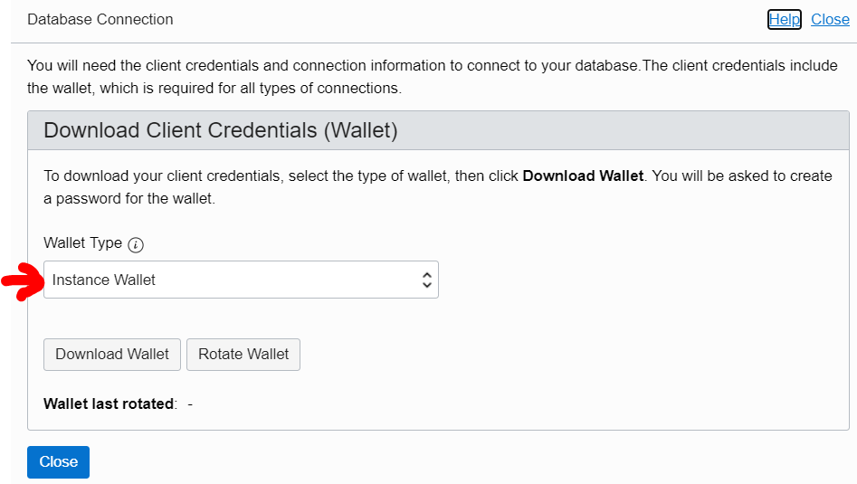
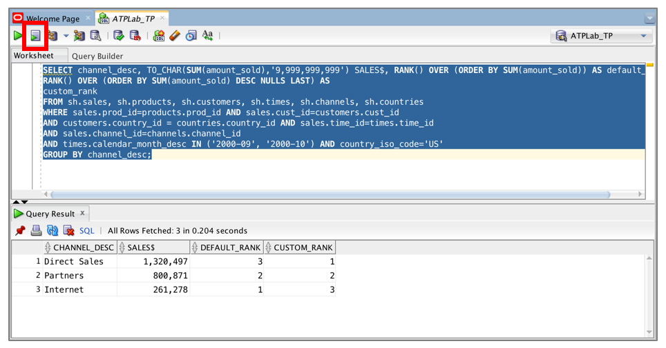
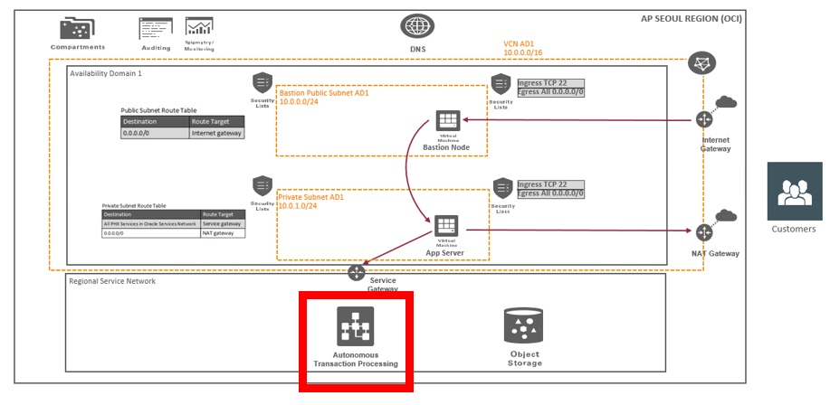

# Create Autonomous Database #

Oracle Autonomous Transaction Processing (ATP) is a fully managed Oracle database service with “self-driving” features on the Oracle Cloud Infrastructure (OCI). An application can securely connect to ATP with the proper credentials and a wallet. 

The following lab guide shows how to provision and securely connect to ATP. 

## Disclaimer ##
The following is intended to outline our general product direction. It is intended for information purposes only, and may not be incorporated into any contract. It is not a commitment to deliver any material, code, or functionality, and should not be relied upon in making purchasing decisions. The development, release, and timing of any features or functionality described for Oracle’s products remains at the sole discretion of Oracle.

## Requirements ##

- Web Browser
- SQL Developer 19.1 or higher

## Step 1: Login to Oracle Cloud ##

​	1. From your browser login into Oracle Cloud

### About Regions and compartments

**Important Note**

Always ensure you are in your correct Region and Compartment. 

If this is an instructor-led lab we are sharing the same tenancy account with multiple students, please create a unique name for your OCI resources that you can identify with. Ie: Use your name or other identifier unique to you to name your cloud resources.

## Step 2: Provision ATP ##

Provision the Autonomous Transaction Processing database (ATP) with the steps below.

​	1. Select your assigned Region from the upper right of the OCI console.

​	2. From the hamburger menu (top left side), select Autonomous Transaction Processing.

​	3. Select your Compartment. You may have to drill in (click “+”) to see your compartment.

​                                   

  

​	4. Select Workload Type Transaction Processing.

​	5. Click Create Autonomous Database. 

 

1. Select your compartment

2. Enter any unique name (maybe your name) for your display and database name. The display name is used in the Console UI to identify your database.

3. Select Transaction Processing for the workload type

4. Select Shared Infrastructure for deployment type

5. Choose database version 19c

6. Configure the database with **2 cores and 1 TB storage**

7. Uncheck Auto scaling. We will enable it later

8. Enter a password. The username is always ADMIN. (Note: remember your password)

9. Do not check the box Configure Access Control Rules. However the best practice is to configure Access Control to your ATP

10. Select BYOL License Type

11. Click Create Autonomous Database

    





Your console will show that ATP is provisioning. This will take about 2 or 3 minutes to complete.



You can check the status of the provisioning in the Work Request.


## Step 3: Download the Wallet

Once your ATP service is running we can connect a client to ATP securely with the Oracle Wallet.

1. Click on the details of your ATP
2. Select DB Connection
3. Select Instance Wallet
4. Download the wallet to your laptop
5. Enter a password for the wallet

Note your connection strings. Your application can connect with these connection services:

- High – for long queries, high parallelism, low SQL concurrency
- Medium – for medium queries, parallelism, medium concurrency
- Low – for short queries, no parallelism, high concurrency
- TPurgent – for high priority transaction processing
- TP – for standard transaction processing






## Step 4: Connect to ATP using SQL Developer

In this lab section you will connect to the ATP with Oracle SQL Developer and browse the ATP configuration. SQL Developer is an Oracle DBA client tool.

Please note that most of the database settings and parameters cannot be modified in a fully-managed Oracle Autonomous Database (ATP and ADW) and that is the whole point of the autonomous service, it runs by itself. 

### Start SQL Developer

1. Start SQL Developer from your client
2. Click + to create a new connection

​                               

​	3. Enter a connection name

​	4. Enter ADMIN as the user

​	5. Enter the password you used to create your ATP

​	6. Check Save Password

​	7. Select Connection Type as Cloud Wallet and Browse for your wallet.

​	8. Browse and select your service. Ie: <your ATP name>_tp. Note there are five services, select the tp service.

​	9. Test the connection and Save your connection for later use. Then click 	Connect.

**Note:** Ensure that you use **ADMIN** user to view any database configuration.


​	10. From your SQL Developer worksheet run the test query below against a sample database that is already in ATP

```
SELECT channel_desc,
 TO_CHAR(SUM(amount_sold),'9,999,999,999') SALES$,
 RANK() OVER (ORDER BY SUM(amount_sold)) AS default_rank,
 RANK() OVER (ORDER BY SUM(amount_sold) DESC NULLS LAST) AS custom_rank
 FROM sh.sales, sh.products, sh.customers, sh.times, sh.channels, sh.countries
 WHERE sales.prod_id=products.prod_id

AND sales.cust_id=customers.cust_id
 AND customers.country_id=countries.country_id
 AND sales.time_id=times.time_id
 AND sales.channel_id=channels.channel_id
 AND times.calendar_month_desc IN ('2000-09','2000-10')
 AND country_iso_code='US'
 GROUP BY channel_desc;
```


 11. Click **F5** or the **Run Script** button. Verify the query executes and results are displayed.

     

You have successfully provisioned and connected SQL Developer to Autonomous Database (ATP) and validated the connection. 



## Acknowledgements ##

- **Author** - Milton Wan, Database Product Management, April 2020

